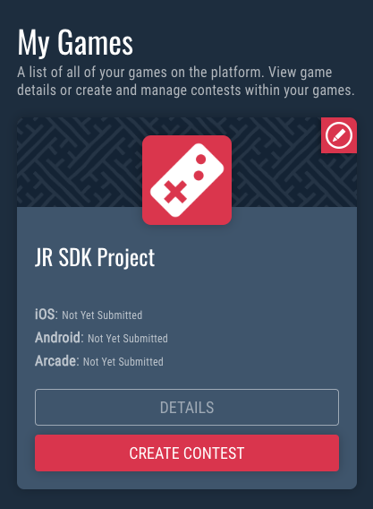
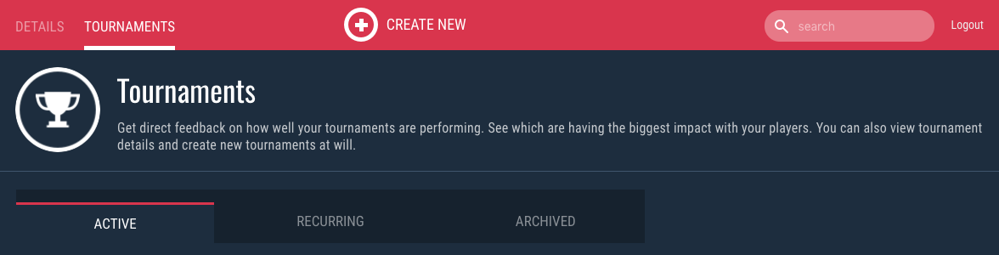
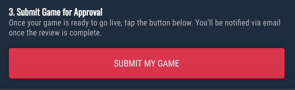
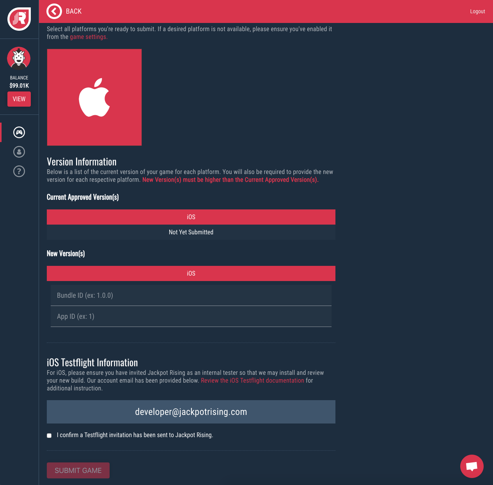
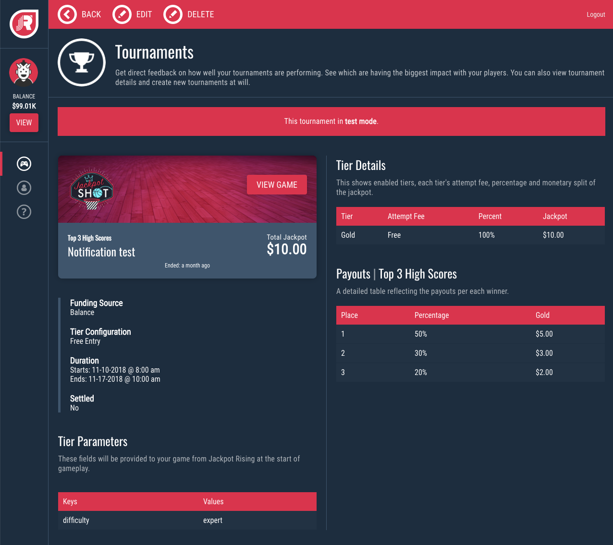
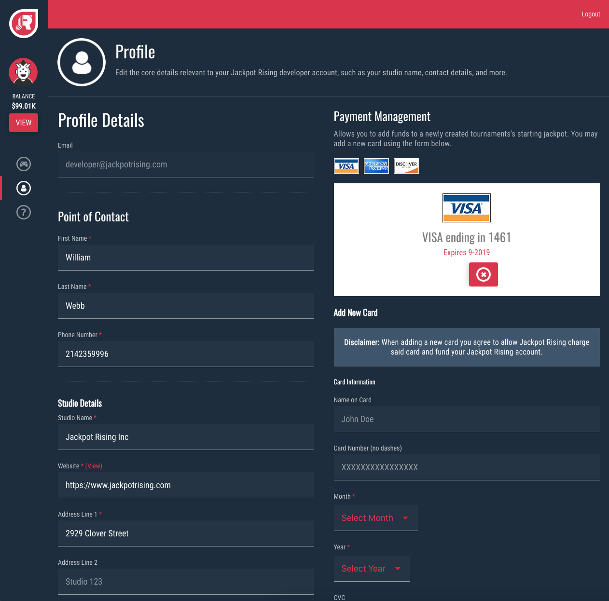
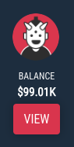
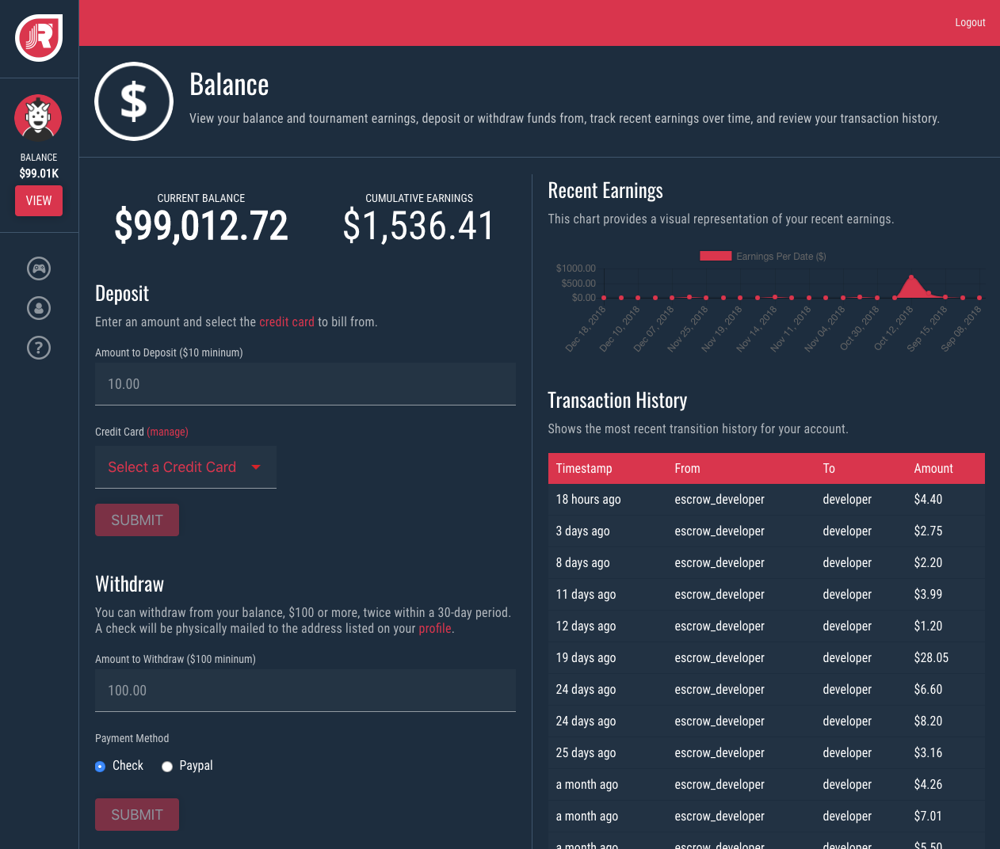

# Homebase Guides

## Submit Game for Review

!> The test build that you submit to Jackpot Rising for approval must be the same version (i.e 1.0 or 1.1) as the production build that you are submitting to Apple.

#### 1. Select Your Game

Select your game by tapping the **Details** button

#### 2. Create a TEST Tournament

For detailed instructions, please see [Creating a Tournament](homebase/integration?id=create-a-tournament)

#### 3. Submit for Approval

Once you have created a test tournament, return to the Game Details page and tap **Submit My Game.**

#### 4. Provide Game Details

1. Select the platform(s) that you will be submitting for the game.
2. Provide the version number and app details for the build that you are submitting.
3. Send an internal tester invitation through Testflight or Hockeyapp to developer@jackpotrising.com

---

## Monitoring Tournaments

#### 1. Select Your Game

Select your game by tapping the **Details** button

#### 2. Select a Tournament

Find your tournament in the list of active tournaments and select **View Details**

#### 3. Review a Tournament

On this page you can see live tournament information, including the leaderboard standings.

---

## Managing Account and Funds

### Manage Account Information

The Account section is where you can see and edit the details for your point of contact, studio, and payment methods.

### Deposit, Withdraw, and More

Start by tapping the **View** button on the left side of the page. 

The Balance section is where you can add or withdraw funds from your account. You also have visibility into transaction history and what your recent earnings have been.

