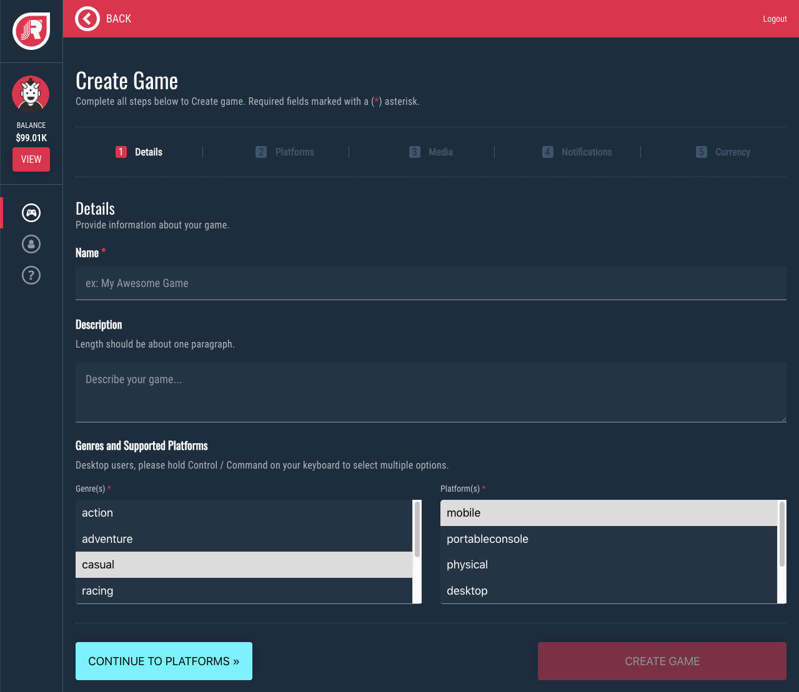
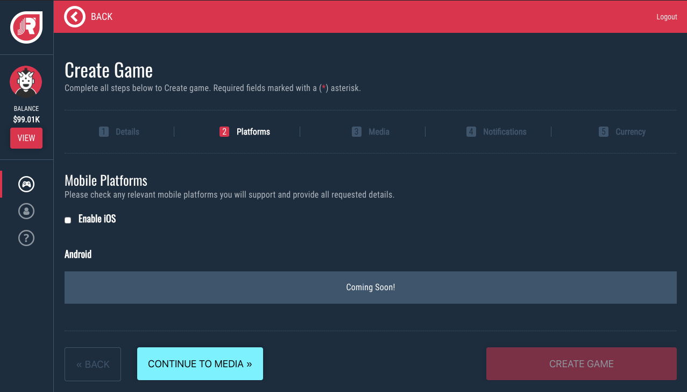
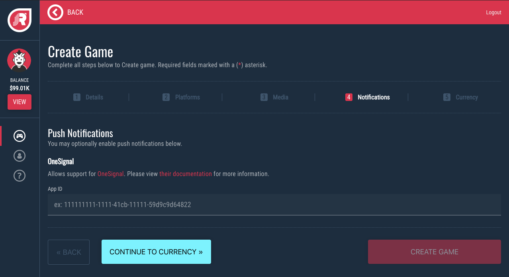
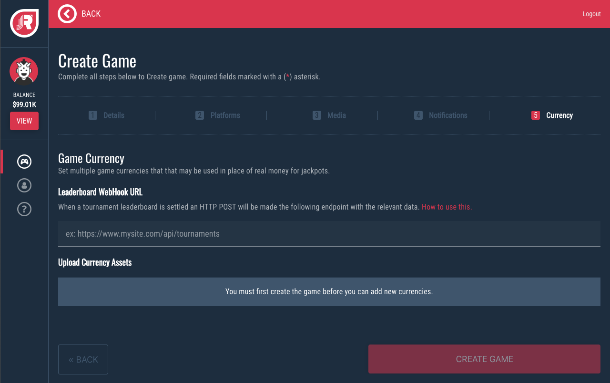
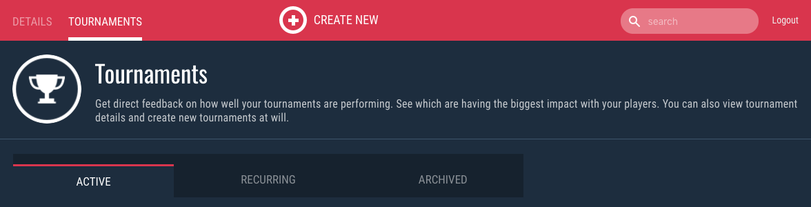
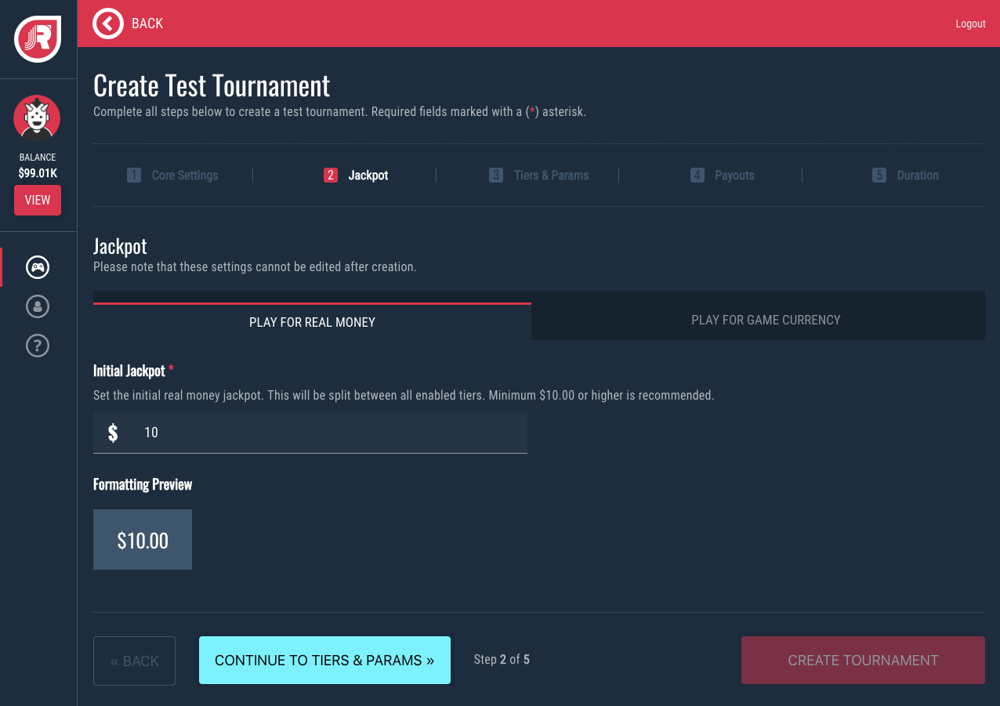
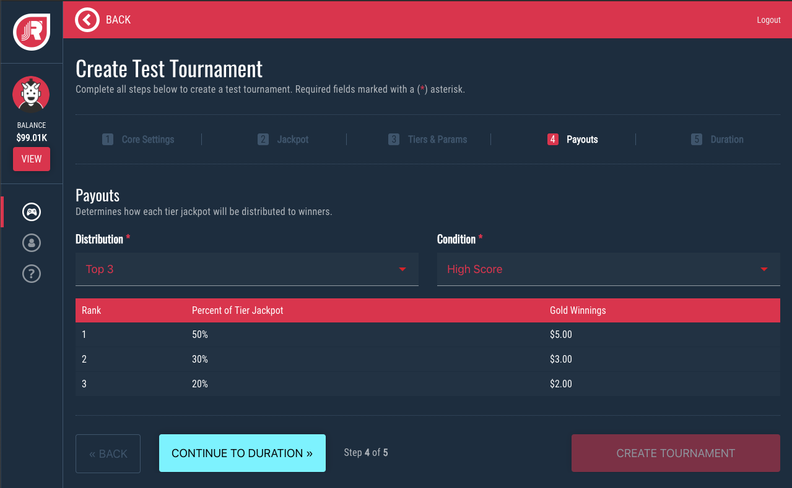

# Homebase Integration

## Register

## [https://homebase.jackpotrising.com](https://homebase.jackpotrising.com ':target=_blank')

!> Tap the **Register** button and complete all required fields.

---

## Add a Game

Login to [Homebase](https://homebase.jackpotrising.com ':target=_blank') and tap the *Add Game* button at the top-left of the page. Provide all required information.

#### 1. Details

Jackpot Rising can use this within the SDK to brand your game on the Jackpot Rising app store.

!> You can select multiple *Genres* or *Platforms* by holding down **Control/Command**

#### 2. Platforms

Provide additional details per each enabled platform.

> Ex: Selecting iOS will prompt you for your game's "iOS store link" and its "iOS bundle"

#### 3. Media

Provide your game's media, including: a video trailer, icon, and backsplash that will be used to brand your game.

**How To Embed a YouTube Trailer**
* Navigate to your YouTube video in a browser
* Tap the SHARE option below the video
* Copy the Video ID from the sharable URL (highlighted in red below)
* Create your embed URL using the Video ID like so: `https://www.youtube.com/embed/{videoid}`
* Add the embed URL to the "YouTube Game Trailer URL" field within Homebase

**Image Size Requirements**
* Icon: 512x512
* Backsplash (Horizontal): 1200x300
* Backsplash (Vertical): 300x1200

#### 4. Notificiations

You may optionally integrate a [OneSignal](https://onesignal.com/ ':target=_blank') account to enable Push Notifications within the platform.

?> Get your OneSignal App ID from the [OneSignal Dashboard](https://documentation.onesignal.com/docs/accounts-and-keys#section-keys-ids ':target=_blank')

**Notification Examples**

* New tournament added
* Tournament ending soon
* Player was knocked out of the money
* Tournament completed

> By default, only the "new tournaments" notification is enabled for players. We limit the number of notifications that go out, so you do not have to worry about your players being spammed!

#### 5. Currency (optional)

If you plan to use a custom game currency in place of real money, provide your assets here.

---

## Generate SDK Credentials

Each game has a unique set of SDK credentials that help authenticate and connect it to the Jackpot Rising platform. Follow the instructions below to retrieve a game's SDK credentials.

Start by tapping the **Games** navigation section.

Select your game by tapping the **Details** button

Generate your Developement and Production SDK keys from the section picture below.

!> You'll need these credentials when integrate your game in Unity or other platforms

---

## Create a Tournament

Start by selecting your game, tap the **Tournament** tab along the top of the screen, then select **Create New**

#### 1. Core Settings

**Live Tournaments vs Test Mode Tournaments**

!> Note: Games must be built with a Test Mode flag enabled to make Test tournaments visible.

There are several key differences between Live Tournaments and Test Mode Tournaments:

* Test Mode acts as a sandbox mode for testing tournaments internally or when submitting for approval.
* Test tournaments do not deduct funds from an account or credit card.
* Test tournaments do not use GPS Location, so you can play from any location.
* Players will never see Test Mode tournaments, since they're visibility is limited to Test Mode games

**Tournament Name**

This is a unique identifier for the tournament, visible to players. We recommend avoiding "Tournament" in the name if possible. DO NOT include "Tournament" for recurring tournaments as this will be appended automatically.

#### 2. Currency

Set the initial funding for your tournament.

**Currency Mode**

* Real Money - all money in/out will utilize real currency in USD
* Game Currency - this utilizes your game's custom currency (ex: gold coins)

> Game Currency is configured in your Game settings

**Initial Jackpot**

The starting jackpot amount. This will be billed to your account the moment the tournament is created.

#### 3. Tiers & Parameters

Settings for configuring attempts, jackpot splits, customizable game parameters, and rules.

**Free vs Paid Entry**

* Free Entry - does not require a player to pay to participate in a tournament
* Paid Entry - utilizes a progressive system where players pay to make an attempt, however a portion of each attempt increases the total jackpot amount

> The majority of the attempt fee goes to the progressive jackpot, with the rest being split between the developer (you) and Jackpot Rising.

**Ad Support**

Allows players to watch video pre-roll ads, which unlock a set number of attempts. This is used in place of paid entry.

?> See the **Ad Support** guide for more information on using this feature.

**Tiers**

Tiers allow you to split your single tournament's jackpot into mutiple "buckets", which can target players at different skill levels. Higher tiers have a higher attempt fee in but larger jackpot payout, and vice versa. A Beginner tier may also be enabled for new players.

**Parameters**

Paramters allow you to provide unique key/value data to your tournament. This data is provided to your game at the beginning of a tournament attempt. This allows you to tailor your gameplay experience for players per tournament.

**Rules**

Allows you to give more information to your users on what differentiates this tournament from standard play. The rules section is also useful to provide the user with any overviews, instructions, tips, or details on the game/tier/tournament.

#### 4. Payouts

Defines the payout structure. This is mirrored per each tier.

**Distribution**

The number of awardees per tier.

**Condition**

The win condition per tier.

**Percentage Table**

Shows the payout split for each awardee per tier. When a Custom distribution is selected it allows you to define each percentage amount.

!> Please make sure that the actual amount being paid out to each tier is sufficient. If you have too many tiers or payout spots enabled for the current starting jackpot, then you could run into an issue where a payout spot receives less than the attempt fee for that tier! If you run into this issue, then please reduce the number of tiers/payouts or increase the starting jackpot amount.

#### 5. Duration

Configures the duration of your tournament.

**Set Mode**

The tournament has a defined start and end date/time

**Recurring Mode**

Recreates the tournament repeatedly at defined interval (ex: daily, etc). The tournament name will be auto-generated for Recurring tournaments.

> Editing a recurring tournament will provide an option to delete it. This will stop it from recurring.
