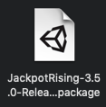
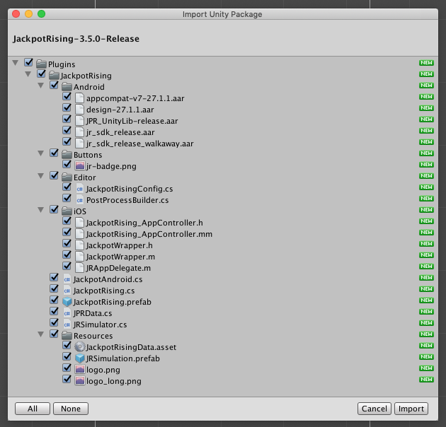
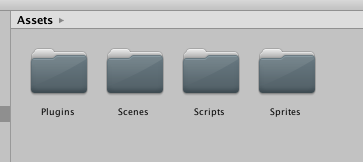
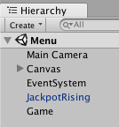
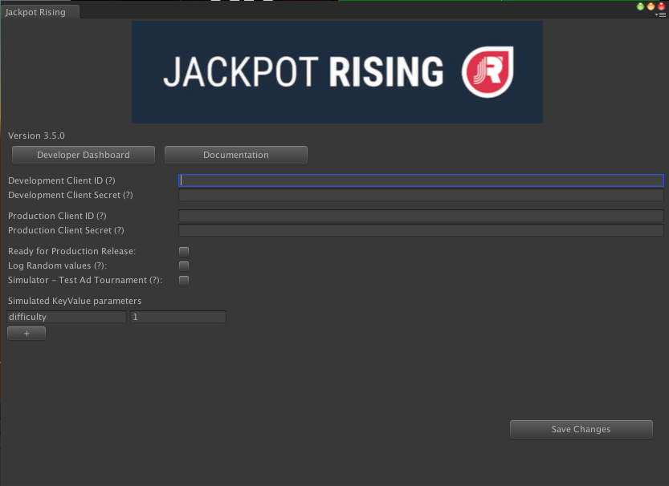
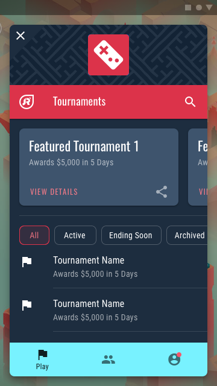

# Unity Integration

## Install the SDK Plugin

#### 1. Download the Plugin

Download: [Jackpot Rising SDK Plugin](https://sdk.jackpotrising.com/JackpotRising-3.5.0-Release.unitypackage)



#### 2. Install the Plugin

Drag the .package file into your root Assets section within Unity. When presented with the import screen, leave everything default and press **Import*.



Once imported, this will create a Plugins folder for you.



**This Includes**

- Everything you need to connect your game logic to the Jackpot Rising platform
- A new SDK Configuration window, found at **Windows > Jackpot Rising > Edit Settings**
- **Plugins > JackpotRising > Buttons** contains a stock UI button you may use for triggering the SDK

#### 3. Add the 'JackpotRising' Prefab to Your Scene

Drag the Jackpot Rising prefab, found under **Plugins > JackpotRising**, into your Unity project scene.

?> Note: The prefab will keep itself active between scenes while automatically initializing the SDK for you.



!> This prefab is required for iOS builds due to how communication works between Unity and iOS.

#### 3. Configure the Plugin

Browse to **Windows > Jackpot Rising > Edit Settings** to view the SDK configuration settings.



- The **Developer Dashboard button** will take you to [Homebase](https://homebase.jackpotrising.com 'target:_blank')
- The **Documentation button** will take you to this documentation website.
- **Developer/Production Client ID and Secret** will be covered in the SDK Credentials section below.
- Three debug checkboxes are present. **Hover over the (?) mark** for more details.
- You can simulate tournament parameters using the **Simulate Key/Value parameters** section  

#### 4. Enter your SDK Credentials

For full instructions see [Generate SDK credentials](homebase/integration?id=generate-sdk-credentials)

---

## Trigger the SDK

!> Ensure you have an active tournament running. See [Create a Tournament](homebase/integration?id=create-a-tournament) for details.

#### 1. Add the Trigger UI

In order the display the Jackpot Rising SDK UI, we'll need an on-screen button within your game. We recommend adding this to your main menu.


> This button is included under: **Plugins > JackpotRising > Buttons**

Call the following to trigger the SDK UI to show:

```csharp
JackpotRising.Show();
```

#### 2. Implement a Tournament Listener

We recommend implement the following into a GameManager script in Unity. Note the class injects `JackpotRising.ContestListener` in addition to `MonoBehaviour`.

?> We've documented key features in the example GameManger script below:

> Note that 'contest' is another term we use for tournaments internally

```csharp
using UnityEngine;

public class MyGameScript : MonoBehaviour, JackpotRising.ContestListener {

    void Start() {
        // Register the listener or it will not receive tournament info!
        JackpotRising.RegisterListener(this);
    }

    // (OPTIONAL) Callback when the Jackpot Rising overlay appears and takes control over the application, pausing the main Unity thread while active.
    public void OnSDKFocused(){}

    // (OPTIONAL) Callback when the player cancels the tournament offer shown from calling JackpotRising.Show();
    public void OnDeclineContestOffer(){}

    // (OPTIONAL) Callback when contest information is loaded and determines what the state of the tournament is. See JackpotRising.CONTEST_STATUS_ constants for the states and values.
    public void OnContestLoaded(int code){}

    // (OPTIONAL) Callback when the Jackpot Rising window is closed with the X button or tournament offer is declined. Unity resumes control of the application when this happens.
    public void OnClosedSDK(){}
  
    // (OPTIONAL) Callback when player is entering an ad-supported tournament (configured on the Developer Dashboard for your tournament)
    // and doesn't have any free attempts left. This signals for you to start an ad, and after it finishes respond with JackpotRising.SubmitAdSuccess(bool) with the state of true or false depending on if the ad was successfully played and rewarded the player with attempts. 
    public void PlayAd(){}

    // (OPTIONAL) Callback with a message as to why the SDK failed to initialize
    public void OnFailedToInitSDK(string message){}

    // Covered in the 'Make an Attempt' section below
    public void StartTournament(long tournamentID, JackpotRising.KeyValues keyvalues) {
        // ...
    }
   
    void OnStartGameplay() {
        // Insert custom game logic here
    }
}
```

With the **Button** and **ContestListener** in place your SDK will have a slightly different experience depending on where you play:

* Unity Preview: You will see a very barebones sample that lets you trigger key methods, like making an attempt
* On iOS or Android devices: you will see the full SDK Overlay UI. Presented below.



?> Note that your UI may differ slightly

---

## Make an Attempt

The following script highlights the `StartTournament()` method used to trigger an attempt. Note the Randomization Seed and Tournament Parameters are made available before gameplay starts.

```csharp
public void StartTournament(long tournamentID, JackpotRising.KeyValues keyvalues)
{
    // You can use the ID for other things if you want
    JackpotRising.SetRandomSeed(tournamentID);

    // Handle Extra Fields tournament data here. This information can be unique for each
    // tournament, allowing flexibility for different levels/modes/attributes between
    // different tournaments.
    GameEventsManager.level = keyvalues.GetInt("level");
    GameEventsManager.levelName = keyvalues.GetString("name");
    GameEventsManager.speed = keyvalues.GetFloat("gameSpeed");
    GameEventsManager.contestStarted = true;

    // Handle any tournament-specific logic that you may want to differ for tournaments
    // in your game. This is just a quick example, so outside of the
    // ContestListener you can do what works best for your project
    OnStartGameplay();
}
```

---

## Submitting a Score

After a gameplay session has ended, you will need to submit the final score to Jackpot Rising through the following method:

```csharp
JackpotRising.SubmitScore(score);
```

!> Score must be of type 'long'

---

## Build for iOS

...

---

## Build for Android

...
