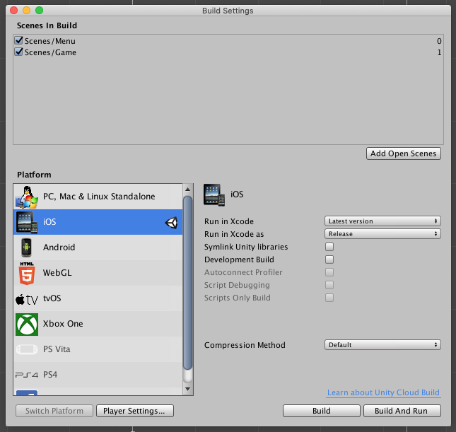
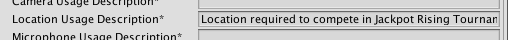
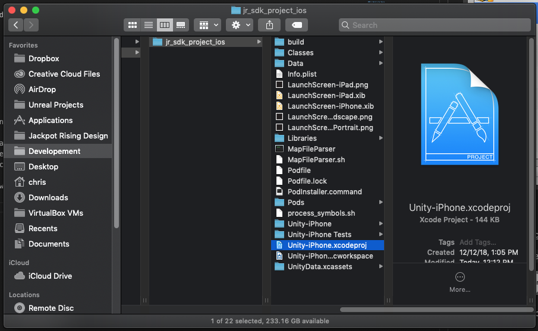
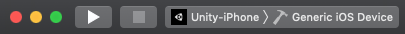

# Unity Integration

## Install the SDK Plugin

#### 1. Download the Plugin

Download the latest version here: [Unity SDK Integration > Requirements](unity/requirements)


#### 2. Install the Plugin

Drag the downloaded .package file into your root Assets directory within Unity. When presented with the import screen, leave everything default and press **Import**.


Once imported, you'll see a new Plugins directory in your Unity project. Contents of this plugin are detailed below.


- Everything you need to connect your game logic to the Jackpot Rising platform
- A new SDK Configuration window, found at *Windows > Jackpot Rising > Edit Settings*
- *Plugins > JackpotRising > Buttons* contains a stock UI button you may use for triggering the SDK

#### 3. Add the 'JackpotRising' Prefab to Your Scene

Drag the `JackpotRising` prefab, found under **Plugins > JackpotRising**, into your Unity project scene.

?> Note: The prefab will keep itself active between scenes while automatically initializing the SDK for you.


!> This prefab is required for iOS builds due to how communication works between Unity and iOS.

#### 4. Configure the Plugin

Browse to **Windows > Jackpot Rising > Edit Settings** to view the SDK configuration settings.


**Options Include**

- The *Developer Dashboard button* will open [Homebase](https://homebase.jackpotrising.com 'target:_blank')
- The *Documentation button* will open this documentation website.
- *Developer/Production Client ID and Secret* will be covered in the 'Enter SDK Credentials' step below.
- *Hover over the (?) mark* for more details on each checkbox option.
- You may simulate tournament parameters using *Simulate Key/Value parameters*  

#### 5. Enter SDK Credentials

If you do not already have your SDK credentials available, please see the instructions here: [Generate SDK credentials](homebase/integration?id=generate-sdk-credentials)

---

## Trigger the SDK

!> Ensure you have an active tournament running. See [Create a Tournament](homebase/integration?id=create-a-tournament) for details.

#### 1. Add a Trigger UI Button

In order the display the Jackpot Rising SDK UI, we'll need an on-screen button within your game. We recommend adding this to your main menu.


> A high resolution version of this button can be found in **Plugins > JackpotRising > Buttons**, but feel free to create a custom button that matches your game's theme

When pressed, the button should trigger the following call. This will trigger the SDK Overlay UI to display:

```csharp
JackpotRising.Show();
```

#### 2. Implement a Tournament Listener

Most games utilize a 'GameManger' script to handle core gameplay logic shared throughout the scope of the game. We recommend follow the example script below for implementing a Tournament Listener (aka Contest Listener). Note the class injects `JackpotRising.ContestListener` in addition to the standard `MonoBehaviour`. Key features have been documented within the script below.

```csharp
using UnityEngine;

public class MyGameScript : MonoBehaviour, JackpotRising.ContestListener {

    void Start() {
        // Register the listener or it will not receive tournament info!
        JackpotRising.RegisterListener(this);
    }

    // (OPTIONAL) Callback when the Jackpot Rising overlay appears and takes control over the application, pausing the main Unity thread while active.
    public void OnSDKFocused(){}

    // (OPTIONAL) Callback when the player cancels the tournament offer shown from calling JackpotRising.Show();
    public void OnDeclineContestOffer(){}

    // (OPTIONAL) Callback when contest information is loaded and determines what the state of the tournament is. See JackpotRising.CONTEST_STATUS_ constants for the states and values.
    public void OnContestLoaded(int code){}

    // (OPTIONAL) Callback when the Jackpot Rising window is closed with the X button or tournament offer is declined. Unity resumes control of the application when this happens.
    public void OnClosedSDK(){}
  
    // (OPTIONAL) Callback when player is entering an ad-supported tournament (configured on the Developer Dashboard for your tournament)
    // and doesn't have any free attempts left. This signals for you to start an ad, and after it finishes respond with JackpotRising.SubmitAdSuccess(bool) with the state of true or false depending on if the ad was successfully played and rewarded the player with attempts. 
    public void PlayAd(){}

    // (OPTIONAL) Callback with a message as to why the SDK failed to initialize
    public void OnFailedToInitSDK(string message){}

    // Covered in the 'Make an Attempt' section below
    public void StartTournament(long tournamentID, JackpotRising.KeyValues keyvalues) {
        // ...
    }
   
    void OnStartGameplay() {
        // Insert custom game logic here
    }
}
```

Please note that when the **Trigger Button** and **ContestListener** are in place you may encounter a slightly different experience depending on where you play:

* Unity Preview: You will see a barebones UI that allows you trigger key methods. This includes making an attempt.
* On iOS or Android devices: you will see the full SDK Overlay UI. An example is shown below.


?> Your UI may differ slightly

---

## Make an Attempt

The following script highlights the `StartTournament()` method used to trigger an attempt. Note the Randomization Seed and Tournament Parameters are made available before gameplay starts.

```csharp
public void StartTournament(long tournamentID, JackpotRising.KeyValues keyvalues)
{
    // You can use the ID for other things if you want
    JackpotRising.SetRandomSeed(tournamentID);

    // Handle Extra Fields tournament data here. This information can be unique for each
    // tournament, allowing flexibility for different levels/modes/attributes between
    // different tournaments.
    GameEventsManager.level = keyvalues.GetInt("level");
    GameEventsManager.levelName = keyvalues.GetString("name");
    GameEventsManager.speed = keyvalues.GetFloat("gameSpeed");
    GameEventsManager.contestStarted = true;

    // Handle any tournament-specific logic that you may want to differ for tournaments
    // in your game. This is just a quick example, so outside of the
    // ContestListener you can do what works best for your project
    OnStartGameplay();
}
```

?> For more information regarding Randomization Seeds see: [Game Randomization](unity/guides?id=game-andomization)

?> For more information regarding Key/Value parameters see: [Tournament Parameters](unity/guides?id=tournament-parameters)

---

## Submit a Score

After a gameplay session has ended, you will need to submit the final score to Jackpot Rising through the following method:

```csharp
JackpotRising.SubmitScore(score);
```

?> Ensure 'scores' is of type ['long'](https://docs.microsoft.com/en-us/dotnet/csharp/language-reference/keywords/long 'target:_blank')

---

## Build for iOS

!> Ensure you have the iOS Build Component installed in Unity before you begin.

#### 1. Set Build Target to iOS

Open **File > Build Settings** then select iOS, then tap the Switch Platform button.



#### 2. Location Text

Under Build Settings **File > Build Settings > Player Settings > Other Settings > Location Usage Description** add the following text:

> Location required to compete in Jackpot Rising Tournaments



This message will be used when prompting for the location persmission, which is required for Jackpot Rising.

#### 3. Ensure Cocopods is Installed

During the build process we'll utilize Cocopods to install some required resources in your Xcode project. This includes the ios native SDK Overlay UI.

!> [Instructions for installing Cocoapods can be found here](https://cocoapods.org/ 'target:_blank')

Enter the following in your terminal to verify Cocopods is installed. If successful a version number will be returned:

```
pod --version
```

#### 3. Build Xcode Project

Tap the Build button and select a destination for your Xcode project.

During each build process you will see a terminal window open automatically. This is Cocopods installing the required resources. Once complete the Xcode project will open automatically for you. Otherwise double-click 'Unity-iPhone.xcodeproj'.



?> You may close the new terminal window at this time.


#### 4. Build to Test Device

Once the Xcode project is open, assuming you have already setup all required Apple Developer provisioning, you can either build for a physical iOS device or the Simulator. To do this, select your device and tap the Build and Run option near the top-left of the screen.



Assuming you've followed all instructions, the SDK should be fully functional within your game.

---

## Build for Android

!> Jackpot Rising for Android is still in developement. Please check back soon.
